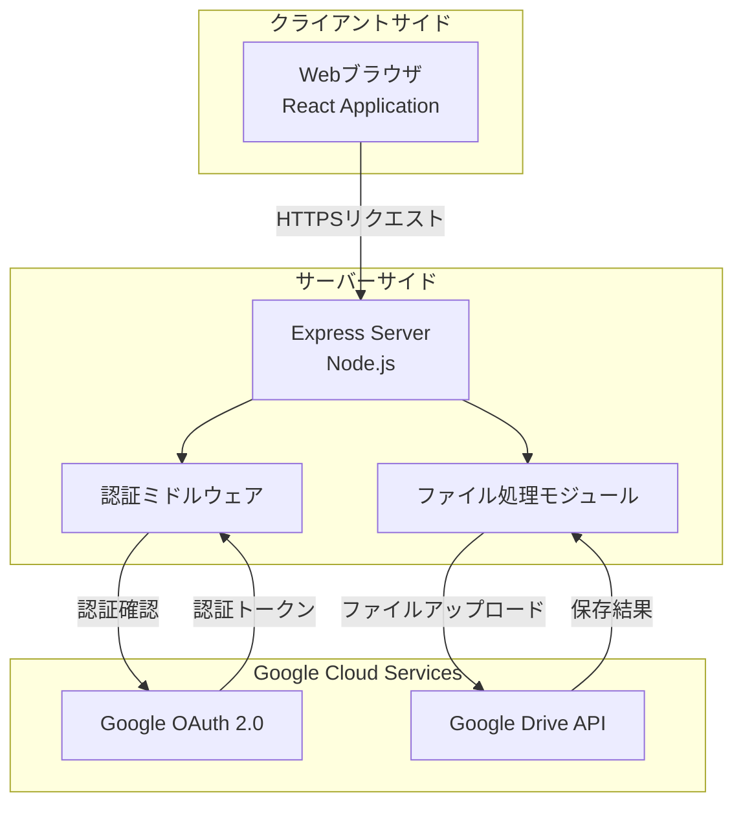
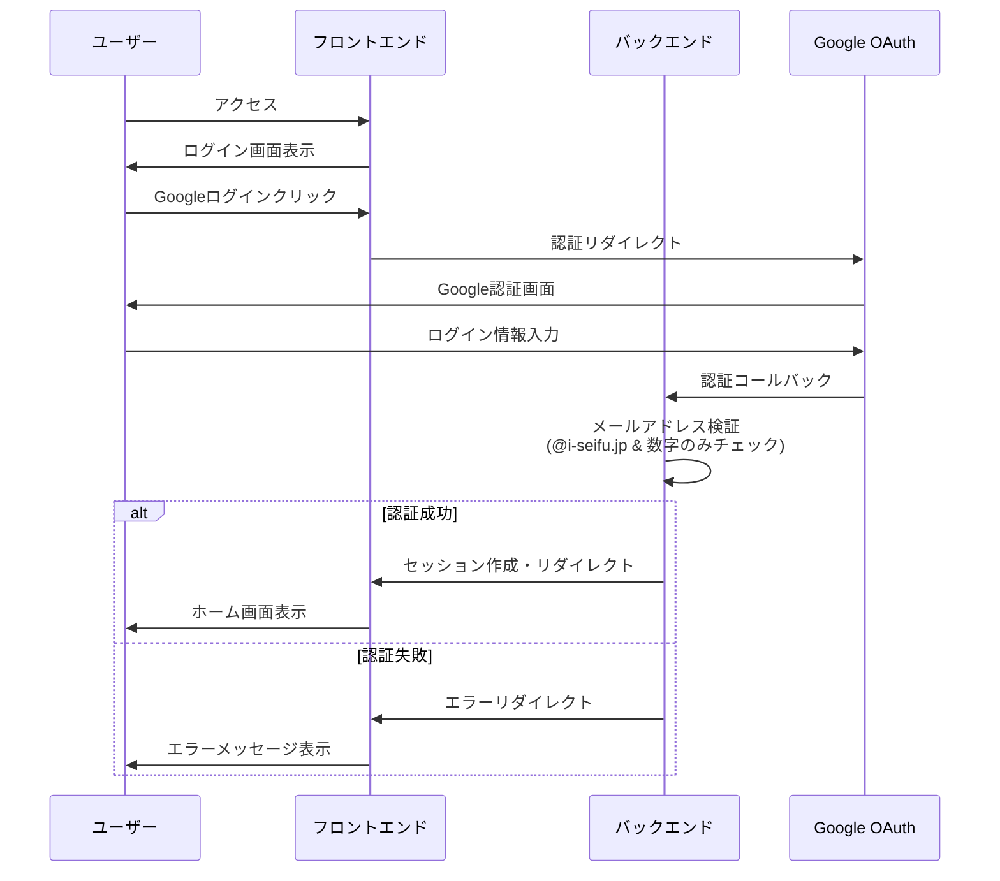
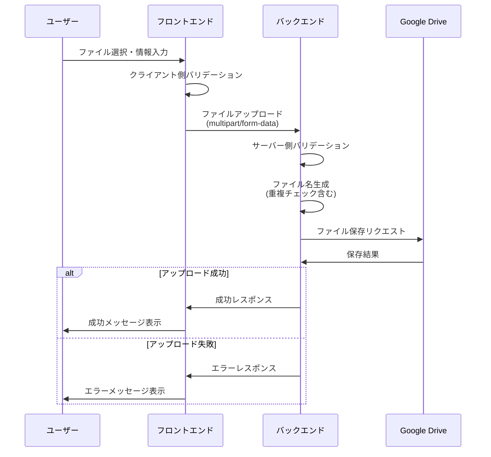
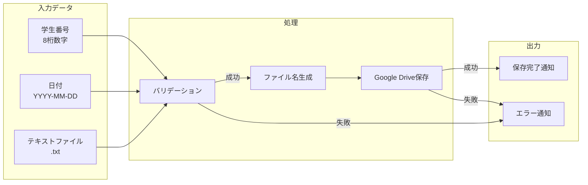
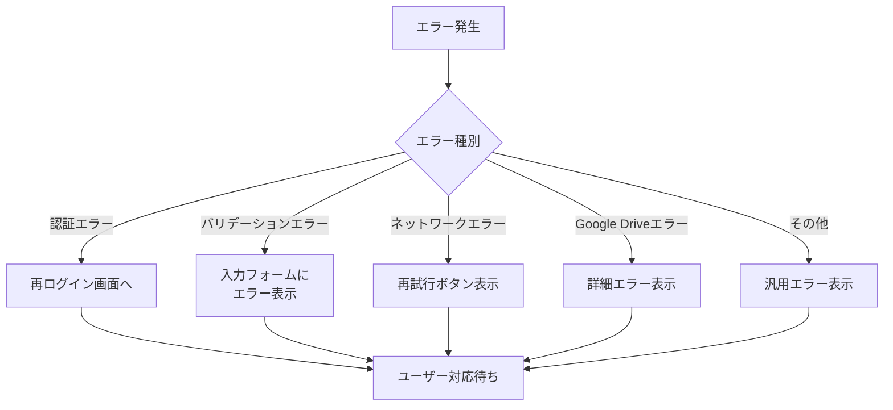

# システムアーキテクチャ概要図

## 全体構成



## 処理シーケンス

### 1. ログインシーケンス



### 2. ファイルアップロードシーケンス



## ディレクトリ構造

```
gdrive-text-uploader/
├── docs/                      # ドキュメント
│   ├── system-design.md      # システム設計書
│   └── architecture-overview.md # アーキテクチャ概要
├── frontend/                  # フロントエンド
│   ├── src/
│   │   ├── components/       # Reactコンポーネント
│   │   ├── services/         # APIクライアント
│   │   ├── utils/            # ユーティリティ関数
│   │   └── App.tsx           # メインアプリケーション
│   └── package.json
├── backend/                   # バックエンド
│   ├── src/
│   │   ├── routes/           # APIルート
│   │   ├── middleware/       # ミドルウェア
│   │   ├── services/         # ビジネスロジック
│   │   ├── utils/            # ユーティリティ関数
│   │   └── server.ts         # サーバーエントリポイント
│   └── package.json
├── .env.example              # 環境変数サンプル
└── README.md                 # プロジェクト説明
```

## データフロー



## エラー処理フロー

